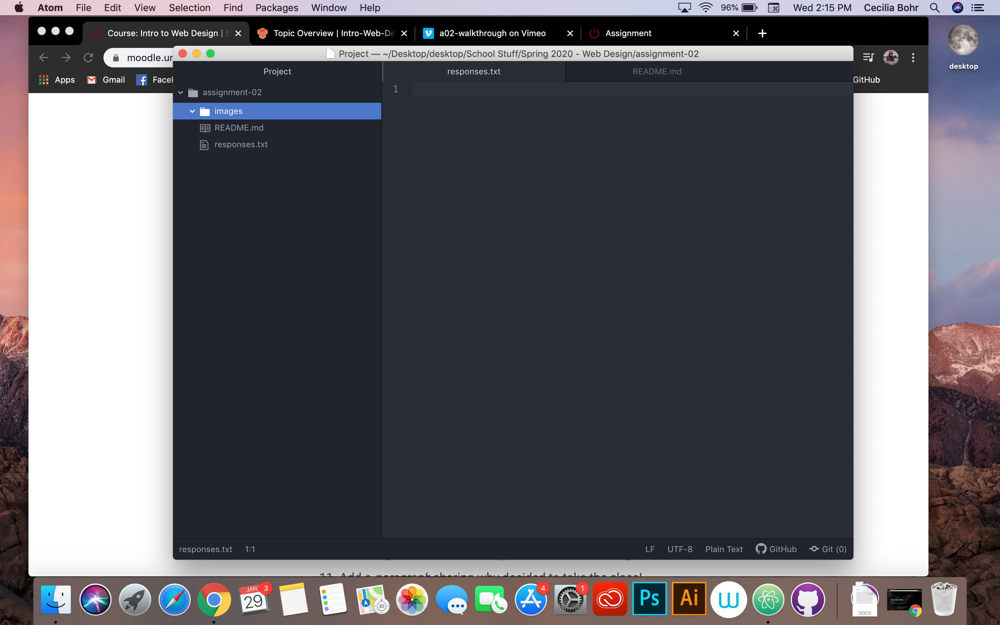

# Assignment-02
## Cecilia Bohr

I decided to take this class because web design has always interested me. I have always been interested in becoming either a web designer or an advertisement designer, so I have been looking forward to taking this class for awhile now! I am hoping to move to a bigger city where there are more website designer jobs available, Bozeman is such a small town and I'm not sure there are many available here!

- I hope to learn how to create a useable website
- I hope to learn how to properly design a website that is appealing
to the eye
- I hope to get feedback on my work and grow from creative critique.

[Netflix](https://www.netflix.com/browse)

[My Responses File](./responses.txt)

