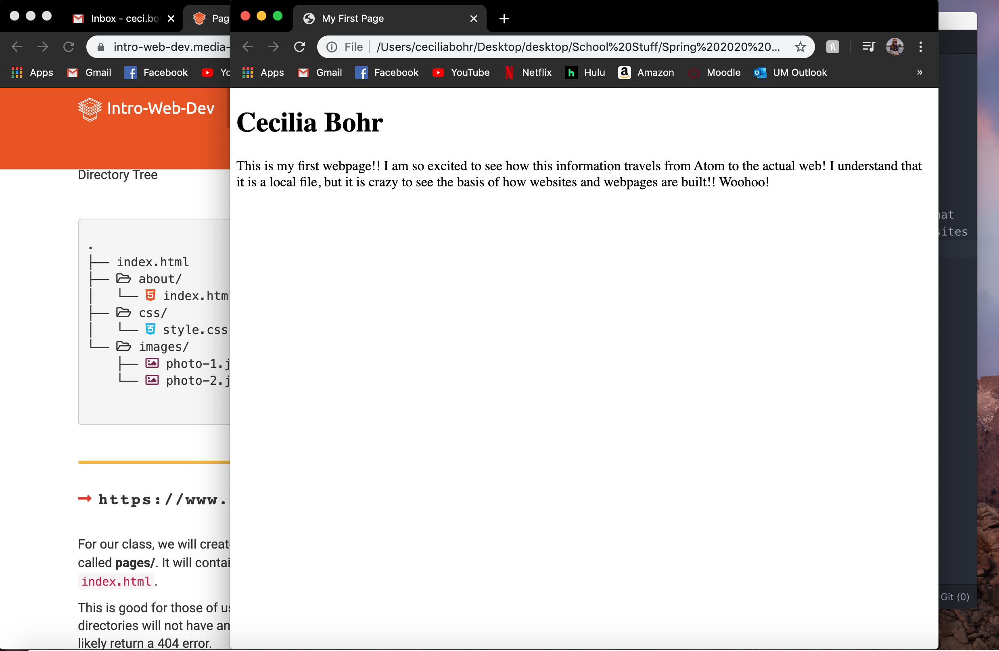

# Assignment-03
## Cecilia Bohr

1. Web browsers work by someone sending a request over a network to a
a server, and it responds back with a collection of different web content. Your browser interprets the content and displays the webpage. I use
the following browsers on my personal laptop regularly:

- Google Chrome
- Safari
- Firefox

2. A markup language is what dictates the architecture of a webpage,
but mainly focusing on its text context. Hypertext Markup Language, otherwise known as HTML, is a very popularly used markup language known worldwide. It plays the role of the foundation for a page's content.

