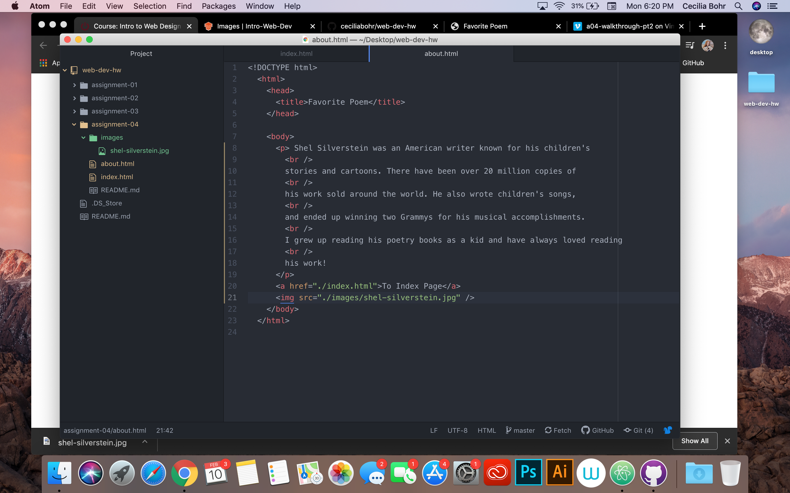

# Assignment-04
## Cecilia Bohr

1. I chose to visit Netflix.com on the Wayback Machine website! I was very curious to see what it looked like over ten years ago! Since there was no online streaming back in 2003, the site looks completely different. They are advertising renting DVD's instead! It has a very basic interface and the info on the page is much more limited than it is now. Now a days, I don't even think you can rent actual DVD's from Netflix anymore, it is solely online streaming!

2. I think the GIT Module is a great system! I like using it much more than I do using the online version, it makes more sense to me and is much more accessible.

