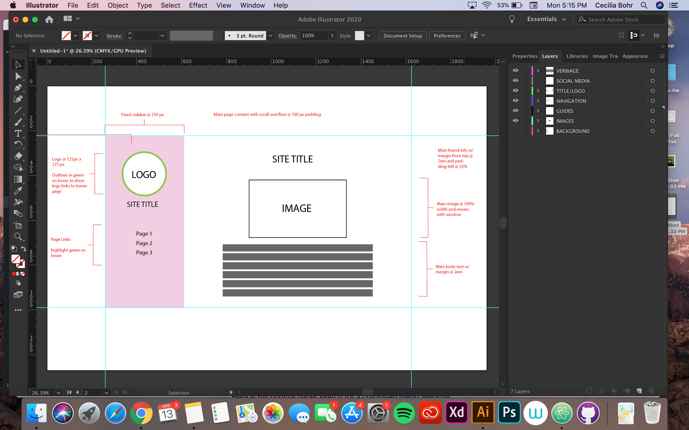

# Assignment-11
## Cecilia Bohr

1. Padding is what you apply to an element if you want it to have padding on each side
of the element. Margins are what you apply to an element if you want it to be a specific
space away from the edges of the web page. Borders are the outline around an element
that you can apply to basically any element, while border-radius is another border
setting you can apply where it rounds the corners of a border.

2. 

3. I had a difficult time working on this project, it was much more challenging to me
than the other assignments have been. But once I figured out how to align elements
correctly and create a visually pleasing website, I felt more comfortable with the
subject matter learned. 
